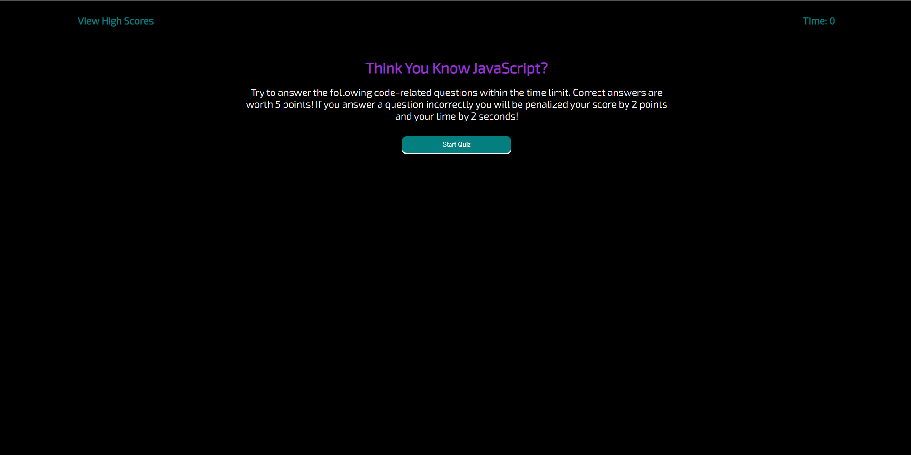

# JS.Quiz

You think you know JavaScript? The quiz has thirteen questions and you have 60 seconds to answer them. You will gain 5 points for every question you get right, but will lose 2 points and 2 seconds off the timer for every question you answer incorrectly.  This quiz will keep track of your scores, with your intials after you hae finished the quiz and your score once you have finished. The teachnology used in creating this web application is HTML,CSS, and JavaScript. 

https://ethanp94.github.io/JS.Quiz/

https://github.com/EthanP94/JS.Quiz

